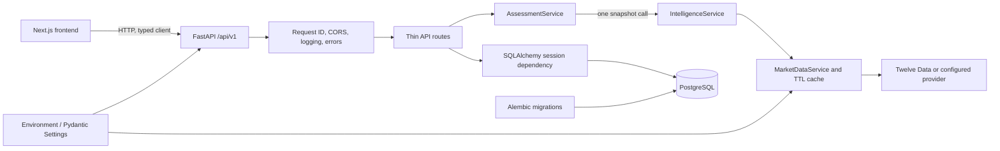

# Platform architecture

## Decision

The backend is a modular monolith. Cross-cutting foundations live in `core`, `db`, `api`, and
`schemas`; market data, intelligence, and assessments are cohesive packages under
`app/modules`. This keeps deployment simple while preserving clear internal boundaries.



## Module boundaries

- `app/modules/market_data` owns provider adapters, provider-neutral schemas, validation,
  resilience, and the in-process cache.
- `app/modules/intelligence` consumes `MarketDataService` and produces the normalized daily
  `IntelligenceSnapshot`.
- `app/modules/assessments` consumes one snapshot through `IntelligenceService` and applies
  deterministic `technical-v1` rules.
- `app/api/v1/routes` performs HTTP validation and delegates to application services.

Phase 4A has no import or runtime dependency on Twelve Data or Alpha Vantage adapters. Provider
selection remains behind `MarketDataService`.

## Assessment request flow

```text
Frontend
  → GET /api/v1/assessments/{symbol}?interval=1day
  → AssessmentService.assess()
  → IntelligenceService.snapshot() exactly once
  → MarketDataService and existing TTL cache
  → Twelve Data or configured provider
```

`AssessmentService` does not persist its output. PostgreSQL remains responsible only for the
existing application foundation; no assessment table or migration exists.

## Configuration flow

Environment variables are parsed once into typed Pydantic settings. Safe development defaults
exist, while production rejects debug mode, placeholder database credentials, and a localhost
frontend origin. Next.js validates its public API base URL and environment name with Zod.

## Request and error flow

Middleware accepts or creates an `X-Request-ID`, times the request, adds the ID to the response,
and emits structured context. Routes return Pydantic response models. Known application errors,
validation failures, missing routes, and unexpected failures are mapped to one safe error
envelope. Internal exceptions are logged server-side without returning stack traces.

## Database-session flow

The dependency opens one SQLAlchemy session per request. A successful request commits; an
exception rolls back; the session always closes. Readiness performs a parameter-free `SELECT 1`.
Alembic owns schema changes, starting with the reversible `system_metadata` table.

## Deliberate exclusions

Redis and distributed task processing have no current workload to serve. Microservices would add
network, deployment, consistency, and observability costs without a current operational need.
Authentication, order execution, portfolio persistence, ML, LLM, and non-technical intelligence
engines are outside the implemented scope.

## Extension rule

Each future capability should enter `app/modules/<capability>` with its own service boundary,
expose only necessary interfaces, and register thin API routes. Cross-module calls should use
application services rather than importing route handlers or provider implementations.

Phase 2 adds the first cohesive module at `app/modules/market_data`. See
[`market-data.md`](market-data.md) for its provider-neutral contracts, request flow, validation,
error mapping and caching decisions. See [`intelligence.md`](intelligence.md) and
[`technical-assessments.md`](technical-assessments.md) for the Phase 3 and Phase 4A contracts.
Phase 5 adds `app/modules/assets`. `AssetIntelligenceService` depends on the separate
`AssetDataProvider` protocol and reuses the configured adapter, `TTLCache`, `MarketDataService`,
and `IntelligenceService`. It has no dependency on `AssessmentService`, and Phase 4A scoring
does not consume Phase 5 fundamentals.

Phase 7 adds `app/modules/market_context`. `MarketContextService` depends on the existing asset
and market-data services plus a dedicated `MarketContextProvider` reference contract. It loads
all price observations through `MarketDataService`, reuses the shared `TTLCache`, and applies
versioned deterministic rules. It does not import Phase 6 news or implement Phase 8 macro data.
See [`market-context.md`](market-context.md).

Cross-module metadata conventions for new intelligence modules are documented in
[`intelligence-metadata-conventions.md`](intelligence-metadata-conventions.md). Existing Phase 3
through Phase 7 contracts remain backward compatible.
