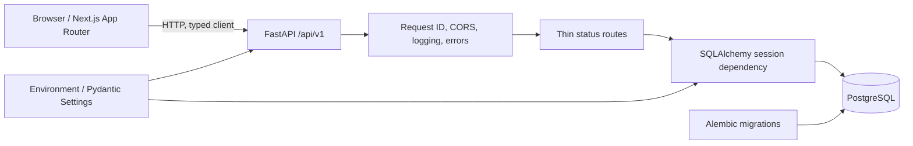

# Phase 1 architecture

## Decision

The backend is a modular monolith. Cross-cutting foundations live in `core`, `db`, `api`,
and `schemas`; future business capabilities will be added as cohesive packages under
`app/modules` only when their phase begins. This keeps transactions and deployments simple
while preserving clear internal boundaries.

## Configuration flow

Environment variables are parsed once into typed Pydantic settings. Safe development defaults
exist, while production rejects debug mode, placeholder database credentials, and a localhost
frontend origin. Next.js validates its public API base URL and environment name with Zod.

## Request and error flow

Middleware accepts or creates an `X-Request-ID`, times the request, adds the ID to the response,
and emits structured context. Routes return Pydantic response models. Known application errors,
validation failures, missing routes, and unexpected failures are mapped to one safe error
envelope. Internal exceptions are logged server-side without returning stack traces.

## Database-session flow

The dependency opens one SQLAlchemy session per request. A successful request commits; an
exception rolls back; the session always closes. Readiness performs a parameter-free `SELECT 1`.
Alembic owns schema changes, starting with the reversible `system_metadata` table.

## Deliberate exclusions

Redis has no Phase 1 workload to serve. Microservices would add network, deployment, consistency,
and observability costs before there are useful domain boundaries. Authentication, market data,
analysis, recommendations, trades, portfolios, and their tables are explicitly deferred.

## Future modules

Each future capability should enter `app/modules/<capability>` with its own service and persistence
boundary, expose only necessary interfaces, and register thin API routes. Cross-module calls
should use application services rather than importing route handlers or ORM internals.

