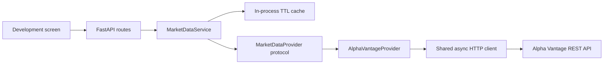
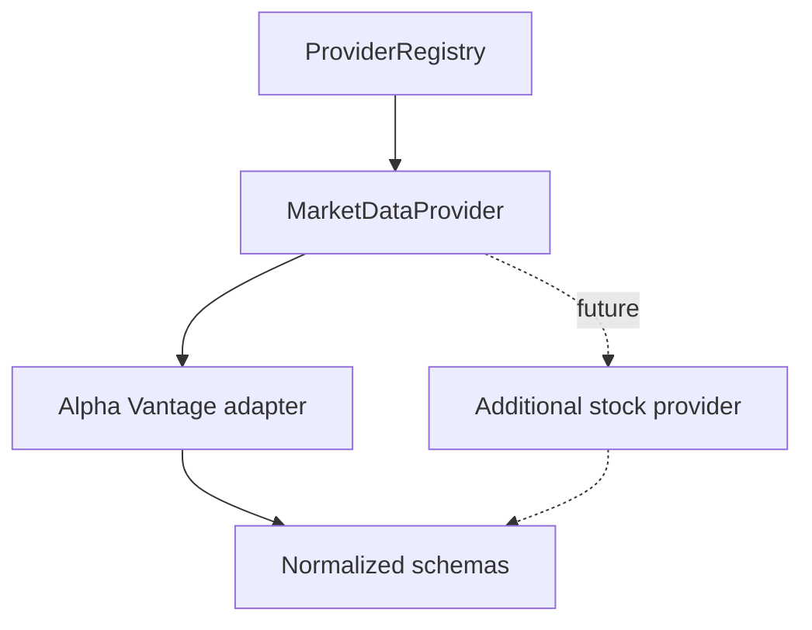
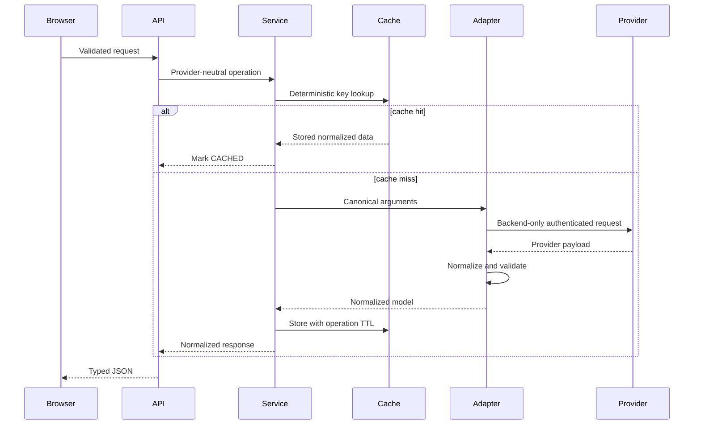
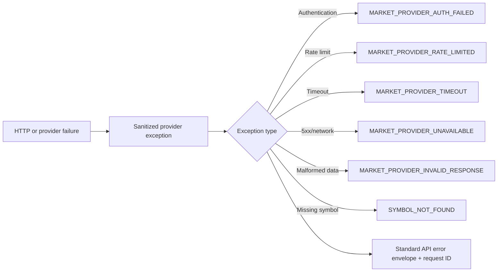

# Market-data foundation

## Provider abstraction

Routes depend on `MarketDataService`, which depends on the `MarketDataProvider` protocol.
`ProviderRegistry` and the factory select the configured adapter; clients cannot choose a
provider. Provider-specific field names, endpoint functions, intervals and errors remain inside
the adapter.

## Active provider

Alpha Vantage was selected for its documented global symbol search, company overview, historical
stock time series and quote endpoint. It requires `MARKET_DATA_API_KEY`.

Important limitations:

- Free API service is limited to 25 requests per day.
- Intraday time series and realtime/delayed entitlements may require a premium plan.
- Default `GLOBAL_QUOTE` values are end-of-day, not live.
- Bid/ask and WebSocket prices are not provided by this Phase 2 adapter.
- Market status is represented as unknown.
- Supported canonical intervals are `5min`, `15min`, `1h` and `1day`; `1h` maps to `60min`.

Capabilities expose these facts without exposing configuration or credentials.

## Normalized schemas

All timestamps are timezone-aware UTC. Price fields use Python `Decimal` and serialize without
binary floating-point calculations. Missing optional provider values remain null. Provider
timestamps and backend `received_at` values are distinct. Data status is one of `UNKNOWN`,
`DELAYED`, `END_OF_DAY`, or `CACHED`; Phase 2 never claims `LIVE`.

## Request flow

## Validation and candle-cleaning policy

Symbols are trimmed, upper-cased and limited to 20 characters containing letters, digits, dots
or hyphens. Search requires two characters and returns stocks only.

Candles require positive OHLC prices, consistent high/low bounds, and non-negative volume.
Legitimate zero volume is preserved. Malformed rows are discarded with a safe warning; responses
include received, accepted and rejected counts. Duplicate timestamps resolve deterministically to
the last parsed row, and accepted candles are sorted ascending before the requested limit is
applied. Invalid intervals and date ranges fail before provider access.

Quotes require a positive price and source date. Bid, ask, spread and market status remain null
when absent. Age is the non-negative difference between provider source timestamp and receipt
time. Alpha Vantage's default quote is marked `END_OF_DAY` and delayed.

## Error mapping

Raw provider bodies, authorization data and API keys are never returned. Authentication errors
are not retried. Rate limits are not retried and expose only a safe numeric `Retry-After` when
available. Timeouts, network failures and 5xx responses receive bounded exponential retries.

## Caching

The cache is process-local and intentionally best-effort. Search/details default to 3600 seconds,
candles to 300 seconds and quotes to 15 seconds. Keys contain only normalized request arguments,
never credentials. Expired entries are removed on access; restart or `clear()` invalidates all
entries. Cache can be disabled. Cached candle/quote responses are explicitly marked `CACHED`.
Multiple backend replicas do not share entries; Redis is deliberately excluded.

## Provider health and readiness

`/market-data/health` performs an explicit lightweight symbol search. It is not called by core
readiness, preventing an external quota or outage from taking the application out of service.
Database connectivity remains mandatory for `/ready`.

## Security and future support

The base URL and provider are server configuration, not client inputs. Limits are enforced before
outbound calls. Logs contain exception types but not raw payloads or secrets. Future adapters
register behind the same protocol and must preserve these schemas, statuses and error contracts.
Streaming exists only as an unimplemented future-compatible method.
